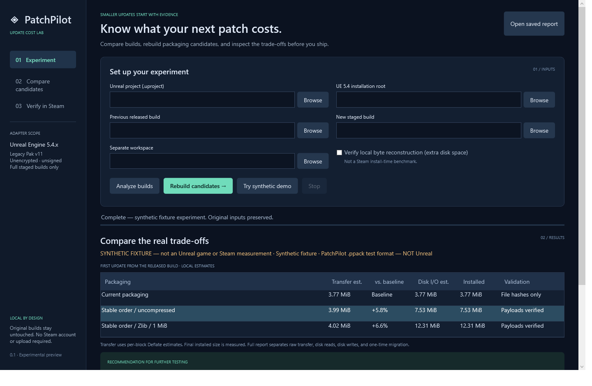

# PatchPilot — Update cost lab

PatchPilot is a local Windows developer tool for investigating large game updates. Compare a released build and a new staged build, rebuild isolated packaging candidates, verify payloads, and see the update-size / disk-work / installed-size trade-offs.

**0.1 experimental preview. Actual Unreal Engine and Steam integration have NOT been qualified. No real-game update reduction is claimed.** The included demo uses synthetic `.ppack` test data, not an Unreal game. Download figures are local estimates, never Steam measurements.

## Run on Windows x64

Download the preview ZIP from [GitHub Releases](https://github.com/appdoctorapp/PatchPilot/releases), extract the entire directory, and run `START_PATCHPILOT.bat` or `App/PatchPilot.App.exe`. The portable package includes the .NET runtime. No signup, payment or Steam credentials are required. It is an unsigned experimental binary.

Click **Try synthetic demo** to exercise the complete pipeline without an engine. The result deliberately demonstrates a trade-off: stable 1 MiB alignment lowers the next same-policy update estimate but costs more during the first migration and increases installed size. It therefore receives **no recommendation** under the default first-update gate.

For your own builds, select a `.uproject`, previous released build directory, new complete staged build directory, a separate workspace, and your UE installation root. **Analyze builds** performs read-only file analysis. **Rebuild candidates** extracts and repackages cooked content. It does not compile the game, recook assets, or edit your project/engine settings.

Select a result to inspect content validation, select it for review, open its folder or HTML report. Selection does not deploy anything. **Stop** cancels work and retains evidence. **Clean scratch** removes temporary payload copies. **Undo generated builds** removes generated build copies while retaining reports and original inputs. CLI `resume` restarts safely in a fresh session.

## Initial adapter scope

| Item | Scope |
|---|---|
| Host | Windows x64; built with .NET 10 / WPF |
| Engine | UE **5.4.x**, explicitly declared in `.uproject` and checked against `Engine/Build/Build.version` |
| Package | Complete staged builds with standard **legacy Pak v11**, unencrypted and unsigned |
| Build tool | Your licensed `Engine/Binaries/Win64/UnrealPak.exe`; not redistributed |
| Candidates | Existing chunk membership + previous entry order; uncompressed 2 KiB padding; Zlib with 1 MiB padding/block size |
| Unsupported | IoStore/mixed builds, encrypted indexes/payloads, signing, `_P.pak` overlays, custom GUID engine associations, custom Pak formats |
| Qualification | Adapter implemented; **real UE 5.4 and Steam testing still required** |

Pak file names, membership and mount paths are preserved. Automatic asset regrouping and chunk reassignment are deferred because dependency and loading semantics require engine-level validation. Unknown listing formats, mismatched payload sets and unsupported mounts fail closed.

## CLI

Run these from the extracted package directory. Use the same conditions for baseline and every candidate.

```powershell
.\Cli\PatchPilot.Cli.exe analyze --project "D:\Game\Game.uproject" --previous "D:\Builds\v1" --current "D:\Builds\v2" --workspace "D:\PatchPilotRuns"
.\Cli\PatchPilot.Cli.exe optimize --project "D:\Game\Game.uproject" --previous "D:\Builds\v1" --current "D:\Builds\v2" --workspace "D:\PatchPilotRuns" --engine "C:\Program Files\Epic Games\UE_5.4" --reconstruct
.\Cli\PatchPilot.Cli.exe demo --output "D:\PatchPilotDemo-new" --scenario small-edit
.\Cli\PatchPilot.Cli.exe recover --session "D:\PatchPilotRuns\SESSION"
.\Cli\PatchPilot.Cli.exe resume --session "D:\PatchPilotRuns\SESSION"
.\Cli\PatchPilot.Cli.exe undo --session "D:\PatchPilotRuns\SESSION"
.\Cli\PatchPilot.Cli.exe select --session "D:\PatchPilotRuns\SESSION" --candidate stable-1m
```

Demo scenarios: `same-content`, `small-edit`, `add`, `delete`. The demo output path must be new. Real inputs never silently fall back to demo mode. Exit status: 0 complete, 2 error/unsupported/partial failure, 130 cancelled.

Every session saves `report.json`, standalone `report.html`, `metrics.csv`, source manifests, candidate settings, response/order files and executable argument arrays. Real Pak runs also save PowerShell rebuild scripts. Keep scratch payloads to replay those scripts; after cleanup, rerun the experiment to regenerate them.

## What the numbers mean

- **Raw transfer estimate:** unmatched 1 MiB fixed blocks, SHA-256 matched within the same relative file, regardless of block position. This is not SteamPipe's proprietary algorithm.
- **Compressed transfer estimate:** unmatched blocks compressed separately with .NET Deflate Fastest, capped at raw size. It excludes Steam protocol/encryption overhead, depot rules and download caches.
- **Disk read / write estimates:** reused old block bytes / entire changed or added files. Changed Paks must be reconstructed in the model. Deletions have no transfer cost; deletion metadata work is not modeled.
- **Temporary space estimate:** changed/new output files, excluding Steam download cache, metadata and other overhead. It is a lower bound.
- **Installed size:** observed sum of file lengths, not filesystem allocated clusters.
- **Local reconstruction seconds:** optional measured local byte-reconstruction workload, including unchanged files. It verifies output hashes but is not actual Steam installation time. OS cache is uncontrolled.
- **Steam download, Steam install time, game launch and scene loading:** unmeasured in this preview. Empty values are not zero.

Three comparisons prevent hiding migration costs: released previous → new candidate; optimized previous → optimized new; released previous → optimized previous with no content changes. A candidate is suggested only if first-update compressed transfer improves, raw transfer and modeled disk I/O do not increase, installed size grows by at most 25%, and payload checks pass. This is a transparent preview heuristic, not release approval.

## Isolation and evidence

Input/project/engine directories cannot overlap the workspace. Links/junctions, path traversal, case collisions and incomplete extraction are rejected. Build inputs are hashed, snapshotted, and checked again. Original files are never patched. Content verification checks exact extracted file sets, SHA-256, mount points, tool success and package tests; it does not prove the game boots or every scene loads.

An active session holds an exclusive lock. Cancellation terminates the owned packaging process tree. Interrupted sessions retain their last atomic report. Recovery only cleans directories inside a matching owned workspace; it never trusts partial output as a completed candidate. Keep enough free space for two snapshots, two versions per policy, extracted payloads and optional reconstruction copies. There is no automatic disk budget yet; disk-full errors are recorded as failures.

No account credentials are accepted. Raw external-tool output is not copied into reports. Basic credential-shaped error values are redacted. Paths and content filenames are present in reports: review them before sharing. There is no telemetry, upload, deployment, Steam login or branch-changing code.

## Build from authorized source

Source is maintained privately, following the App Doctor distribution model. The public repository contains product documentation and downloads, not application source.

```powershell
pwsh -File scripts/Build.ps1
pwsh -File scripts/Build.ps1 -Portable
```

No third-party NuGet libraries are used. A .NET 10 SDK is needed to build. Source layout: `src/PatchPilot.Core` (analysis, adapters, orchestration), `src/PatchPilot.Cli`, `src/PatchPilot.App` (English WPF UI), and `tests/PatchPilot.Tests` (executable test suite).

## Before a commercial release

Use an owned UE 5.4 project, two full staged releases, the matching UnrealPak tool and an authorized private Steam test branch. Repeat no-content rebuild / small edit / add / delete experiments on a real game, verify loading and boot behavior, measure first migration and subsequent updates in Steam, and characterize results across SSD/HDD and cold/warm caches. Do not deploy to a live Steam branch without separate approval.

Read [VALIDATION.md](VALIDATION.md), [RESEARCH.md](RESEARCH.md), and [THIRD-PARTY-NOTICES.md](THIRD-PARTY-NOTICES.md). Free evaluation under [LICENSE](LICENSE); no paid-product performance claims. Not affiliated with Valve or Epic Games.

## Actual preview interface


